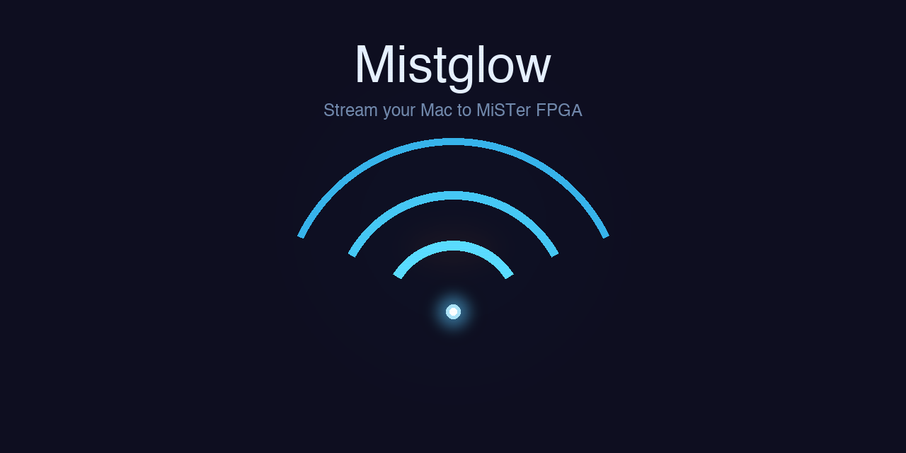

# Mistglow

A native macOS app that streams your screen and audio to a [MiSTer FPGA](https://mister-devel.github.io/MkDocs_MiSTer/) running the [Groovy_MiSTer](https://github.com/psakhis/Groovy_MiSTer) core.

Mistglow captures your display at low resolution (240p/480i/480p) and sends it over UDP to your MiSTer, which outputs it as a real analog signal through the FPGA's video DAC. Perfect for playing modern games on a CRT, streaming retro-styled content, or just sending your Mac's screen to a vintage display.

## Acknowledgments

Mistglow is a macOS port inspired by the original Windows **MiSTerCast** application by **[psakhis](https://github.com/psakhis)**. The Windows version is part of the [Groovy_MiSTer](https://github.com/psakhis/Groovy_MiSTer) project, which pioneered streaming video to MiSTer FPGA over the Groovy protocol. This project wouldn't exist without that foundational work.

## Features

- Stream your Mac display to MiSTer FPGA over UDP
- Multiple modeline presets (NTSC & PAL, progressive & interlaced)
- System audio capture and streaming (48kHz stereo PCM)
- Crop modes: 1X-5X scaling, Full 4:3, Full 5:4, or custom
- Display alignment (9 positions) and rotation (0/90/180/270)
- Live preview of the capture region
- Menu bar mode: streaming continues when the window is closed
- macOS Tahoe Liquid Glass UI when available (falls back gracefully on older macOS)
- Auto-saving settings

## Requirements

- macOS 14 (Sonoma) or later
- A MiSTer FPGA running the Groovy_MiSTer core
- Both devices on the same network

## Permissions

Mistglow requires the following macOS permissions:

- **Screen Recording** - to capture your display for streaming
- **Microphone / Audio** - to capture system audio (uses ScreenCaptureKit)

On first launch, macOS will prompt you to grant these permissions. You can also manage them in **System Settings > Privacy & Security > Screen Recording**.

## Building from Source

### Prerequisites

- Xcode Command Line Tools (`xcode-select --install`)
- Swift 5.9+

### Build & Run

```bash
# Clone the repository
git clone https://github.com/YOUR_USERNAME/Mistglow.git
cd Mistglow

# Build with Swift Package Manager
swift build

# Run the built binary
.build/debug/Mistglow
```

### Creating an App Bundle

The `build.sh` script handles building, code signing, and installing to `/Applications`. You'll need to set up your own code signing identity:

```bash
# Edit build.sh to use your signing identity, then:
chmod +x build.sh
./build.sh
```

## Quick Start

1. Start the **Groovy_MiSTer** core on your MiSTer FPGA
2. Open Mistglow and enter your MiSTer's IP address (or hostname)
3. Select a modeline preset matching your desired output
4. Configure capture source and crop settings in the Capture tab
5. Click **Start Streaming**

## Protocol

Mistglow implements the Groovy protocol (UDP port 32100):

| Command | ID | Description |
|---------|-----|-------------|
| CLOSE | 0x01 | Terminate connection |
| INIT | 0x02 | Initialize with version info |
| SWITCHRES | 0x03 | Set video mode (modeline) |
| AUDIO | 0x04 | Send audio samples |
| BLIT_FIELD_VSYNC | 0x07 | Send video frame/field |

## Project Structure

```
Sources/
  CLZ4/              # LZ4 compression (C library)
  Mistglow/
    App/             # App entry point, state management, settings
    Views/           # SwiftUI views (Stream, Capture, Log tabs)
    Streaming/       # Stream engine, frame processing, protocol
    Capture/         # Screen capture, preview
    Protocol/        # Groovy protocol, network connection
Resources/
  modelines.dat      # Video mode definitions
```

## License

MIT
