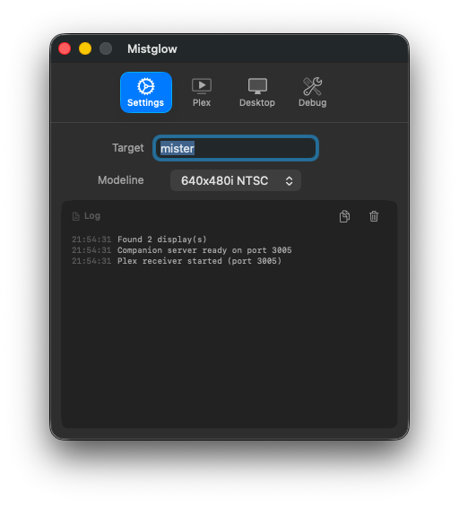
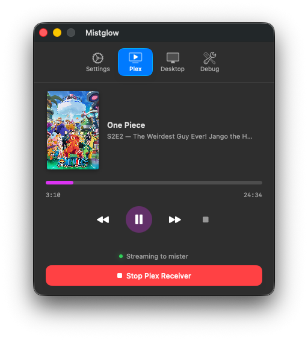
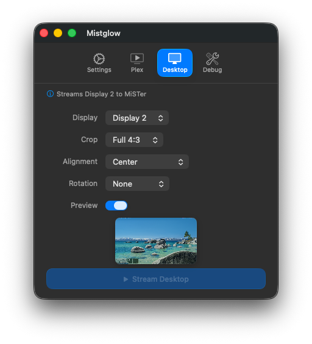

# Mistglow

A native macOS app that streams your screen and audio to a [MiSTer FPGA](https://mister-devel.github.io/MkDocs_MiSTer/) running the [Groovy_MiSTer](https://github.com/psakhis/Groovy_MiSTer) core.

Mistglow captures your display at low resolution (240p/480i/480p) and sends it over UDP to your MiSTer, which outputs it as a real analog signal through the FPGA's video DAC. Perfect for playing modern games on a CRT, streaming retro-styled content, or just sending your Mac's screen to a vintage display.

## Screenshots

<p align="center">
  
  
  
</p>

## Standing on the Shoulders of Giants

Mistglow is a native macOS reimplementation of **[MiSTerCast](https://github.com/iequalshane/MiSTerCast)**, the original Windows streaming application created by **[iequalshane](https://github.com/iequalshane)** and **[sonic74](https://github.com/sonic74)**. The Windows MiSTerCast is a C++/C# application that streams your PC screen to MiSTer over the Groovy protocol -- it did all the hard work of figuring out the protocol, frame timing, modeline handling, and proving that low-latency UDP streaming to a MiSTer was practical.

The Groovy protocol itself and the **Groovy_MiSTer** FPGA core were created by **[psakhis](https://github.com/psakhis)**, who built the entire system for streaming video to MiSTer FPGA with extremely low latency (~3ms). The core handles dynamic mode switching, LZ4 decompression on the FPGA, and real analog video output.

Mistglow simply brings that same MiSTerCast experience to Mac users. If you're on Windows, use the [original MiSTerCast](https://github.com/iequalshane/MiSTerCast) -- it's the real deal.

Thank you to psakhis, iequalshane, and sonic74 for making this possible and sharing your work with the community.

## Streaming Options

Mistglow offers two ways to stream content to your MiSTer:

### 1. Desktop Streaming

Capture any Mac display and stream it directly. Great for games, videos, or anything on your screen.

- Select which display to capture
- Choose a crop mode (1X-5X scaling, Full 4:3, Full 5:4, or custom)
- Adjust alignment and rotation
- Audio is captured alongside video via ScreenCaptureKit

### 2. Plex Media Streaming

Cast movies and TV shows from your Plex library directly to MiSTer. Mistglow appears as a cast target in your Plex apps.

**How to cast:**
1. Start the Plex Receiver in Mistglow's Plex tab
2. Open **Plex Web** (recommended -- most reliable for discovering the MiSTer cast target), or any Plex app on your network
3. Play something and tap the cast/player icon
4. Select **MiSTer** from the device list
5. Video and audio stream to your MiSTer via FFmpeg

Plex streaming includes full playback controls (play/pause, seek, skip), episode queue with auto-play next, and thumbnail art display.

> **Note:** Plex Web is currently the most reliable way to discover the MiSTer cast target. iOS and other Plex apps may not always find it depending on your network configuration.

## Features

- Stream your Mac display to MiSTer FPGA over UDP
- Plex media casting with full playback controls
- Multiple modeline presets (NTSC & PAL, progressive & interlaced)
- System audio capture and streaming (48kHz stereo PCM)
- Crop modes: 1X-5X scaling, Full 4:3, Full 5:4, or custom
- Display alignment (9 positions) and rotation (0/90/180/270)
- Live preview of the capture region
- Menu bar mode: streaming continues when the window is closed
- Auto-play next episode in Plex queues
- Auto-saving settings

## Download & Install

1. Download `Mistglow-macOS-universal.zip` from the [latest release](https://github.com/jcramer83/Mistglow/releases/latest)
2. Unzip and move `Mistglow.app` to `/Applications`
3. Remove the macOS quarantine flag (required for ad-hoc signed apps):
   ```bash
   xattr -cr /Applications/Mistglow.app
   ```
4. Open Mistglow from `/Applications`

## Requirements

### On your Mac
- macOS 14 (Sonoma) or later
- [FFmpeg](https://formulae.brew.sh/formula/ffmpeg) installed (`brew install ffmpeg`) -- required for Plex streaming
- Both devices on the same local network (direct ethernet recommended for best performance)
- Set your display to ~60Hz (high refresh rate monitors are not supported)

### On your MiSTer FPGA

**Groovy_MiSTer must be installed and running before Mistglow can connect.** Follow the [Groovy_MiSTer setup guide](https://github.com/psakhis/Groovy_MiSTer) to get it working:

1. Copy `MiSTer_groovy` binary to `/media/fat` on your MiSTer
2. Copy `Groovy.rbf` to `/media/fat/_Utility`
3. Add to your `MiSTer.ini`:
   ```ini
   [Groovy]
   main=MiSTer_groovy
   ```
4. Launch the **Groovy** core from the MiSTer menu (under Utility)
5. The core will wait for an incoming connection

> **Tip:** It's recommended to verify Groovy_MiSTer is working with [GroovyMAME](https://github.com/psakhis/Groovy_MiSTer) on a Windows or Linux PC first before using Mistglow, to confirm your network and MiSTer setup are correct.

### Audio

To stream audio, you must enable audio on the Groovy_MiSTer core (via the MiSTer OSD menu while the core is running).

## macOS Permissions

Mistglow requires the following permissions:

- **Screen Recording** -- to capture your display for streaming
- **Microphone / Audio** -- to capture system audio (uses ScreenCaptureKit)

On first launch, macOS will prompt you to grant these. You can manage them anytime in **System Settings > Privacy & Security > Screen Recording**.

## Quick Start

### Desktop Streaming
1. **Start the Groovy core** on your MiSTer FPGA (Utility > Groovy)
2. Open **Mistglow** on your Mac
3. Enter your MiSTer's **IP address** (or hostname `MiSTer` if mDNS is set up)
4. Select a **modeline preset** matching your desired output (e.g., 320x240 NTSC)
5. Go to the **Desktop** tab to configure display source and crop settings
6. Click **Stream Desktop**

### Plex Streaming
1. **Start the Groovy core** on your MiSTer FPGA
2. Open **Mistglow** and configure your MiSTer's IP and modeline
3. Go to the **Plex** tab and click **Start Plex Receiver**
4. Open **Plex Web** in your browser, play something, and cast to "MiSTer"

## Known Issues

- **Audio crackling** -- Occasional light crackling during Plex playback. Under active investigation.
- Frames may be dropped or doubled due to sync with the video signal
- Expect 1-2 frames of minimum latency
- Maximum recommended resolution is **720x480i** (network throughput limitation)
- High refresh rate monitors (120Hz+) are not supported -- set your display to ~60Hz
- If the app crashes during streaming, you may need to restart the Groovy core on MiSTer
- Plex iOS app may not discover the MiSTer cast target on some networks -- use Plex Web as a workaround

## Modelines

Mistglow ships with preset modelines for common resolutions:

| Preset | Resolution | Standard |
|--------|-----------|----------|
| 256x240 | 256x240p | NTSC / PAL |
| 320x240 | 320x240p | NTSC / PAL |
| 320x480i | 320x480i | NTSC / PAL |
| 640x480i | 640x480i | NTSC / PAL |
| 720x480i | 720x480i | NTSC |
| 720x576i | 720x576i | PAL |

Custom modelines can be defined in `modelines.dat`. For best synchronization, match your Mac's refresh rate to the modeline. Additional modeline examples: [geocities.ws/podernixie/htpc/modes-en.html](https://www.geocities.ws/podernixie/htpc/modes-en.html)

## Building from Source

### Prerequisites

- Xcode Command Line Tools (`xcode-select --install`)
- Swift 5.9+
- FFmpeg (`brew install ffmpeg`) -- for Plex streaming

### Build & Run

```bash
git clone https://github.com/jcramer83/Mistglow.git
cd Mistglow

# Build with Swift Package Manager
swift build

# Run the built binary
.build/debug/Mistglow
```

### Creating an App Bundle

The `build.sh` script handles building, ad-hoc code signing, and installing to `/Applications`:

```bash
chmod +x build.sh
./build.sh
```

### Troubleshooting: "damaged or incomplete" error

If macOS shows **"You can't open the application because it may be damaged or incomplete"**, this is caused by Gatekeeper quarantine on downloaded files. Fix it by running:

```bash
xattr -cr /Applications/Mistglow.app
```

If building from source, make sure you run `build.sh` (which handles signing) rather than just copying the `.app` bundle directly -- the bundle in the repo is a skeleton without a binary.

## Protocol

Mistglow implements the Groovy protocol (UDP port 32100):

| Command | ID | Description |
|---------|-----|-------------|
| CLOSE | 0x01 | Terminate connection |
| INIT | 0x02 | Initialize with version info |
| SWITCHRES | 0x03 | Set video mode (modeline) |
| AUDIO | 0x04 | Send audio samples |
| BLIT_FIELD_VSYNC | 0x07 | Send video frame/field |

## Project Structure

```
Sources/
  CLZ4/              # LZ4 compression (C library)
  Mistglow/
    App/             # App entry point, state management, settings
    Views/           # SwiftUI views (Settings, Plex, Desktop, Debug tabs)
    Streaming/       # Stream engine, frame processing, protocol
    Plex/            # Plex companion server, GDM discovery, FFmpeg renderer
    Protocol/        # Groovy protocol, network connection
Resources/
  modelines.dat      # Video mode definitions
```

## License

MIT
